# MarketPulse

MarketPulse is a full-stack market intelligence and portfolio platform.

Feel free to check it out here: [text](https://marketpulse-ai-rho.vercel.app/)

It combines market overview data, commodities, top company tracking, watchlists, personal portfolio analytics, and deep single-stock analysis (charting, signals, prediction calculations, and AI summaries).

## What the Website Can Do

- Show a live market overview with quick context for current conditions
- Track commodities alongside equities for broader macro awareness
- Surface the largest companies and market movers in one dashboard
- Let users maintain a watchlist and jump quickly to detail pages
- Let users manage a personal portfolio and inspect position-level details
- Provide individual stock intelligence:
  - chart review
  - reversal/pattern signals
  - prediction calculations
  - technical indicators
  - comprehensive AI-style analysis
  - latest news monitoring

## Product walkthrough (latest images)

See **`USERGUIDE.md`** for full explanations. Thumbnails below match `docs/images/` (filenames with numbered prefixes).

### 1) Sign up
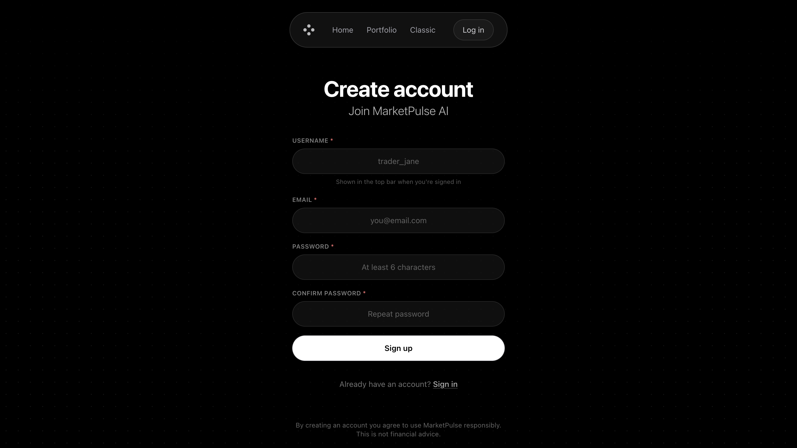

### 2) Home — watchlist screener
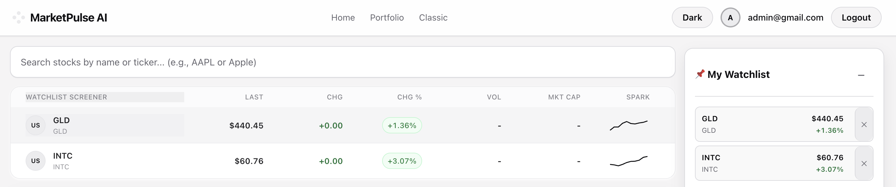

### 3) Market overview
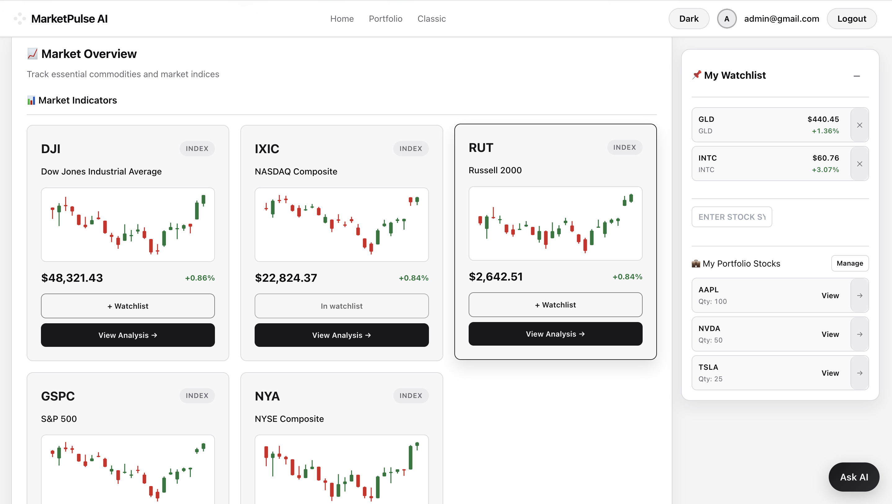

### 4) Stock cards & market movers
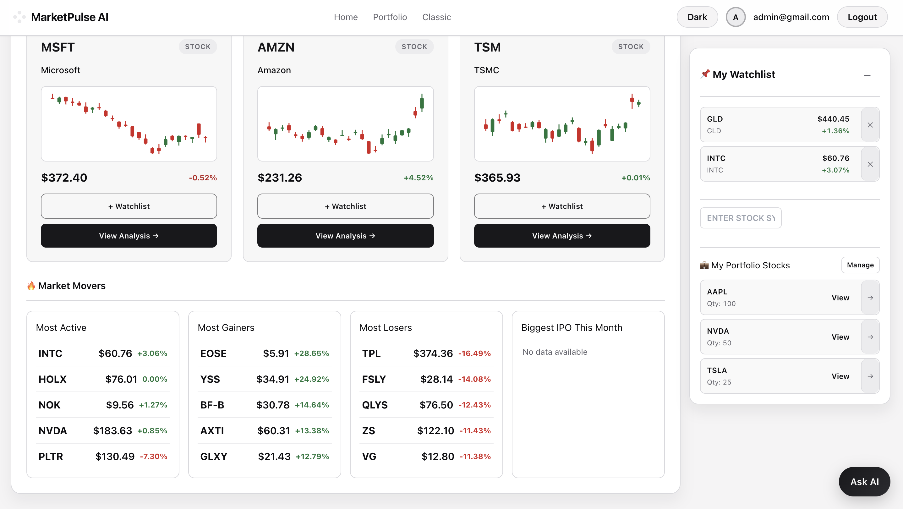

### 5) Portfolio overview
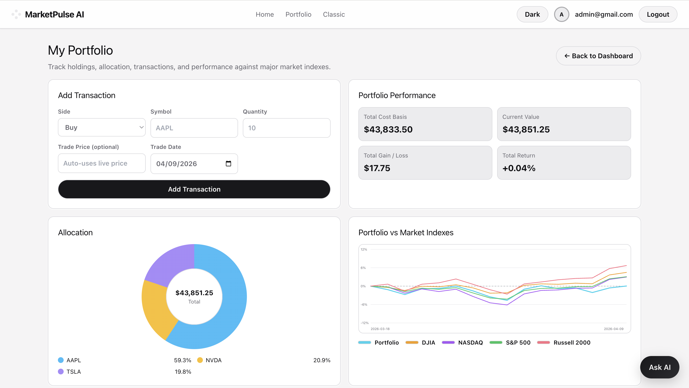

### 6) Holdings & transactions


### 7) Stock — predictions
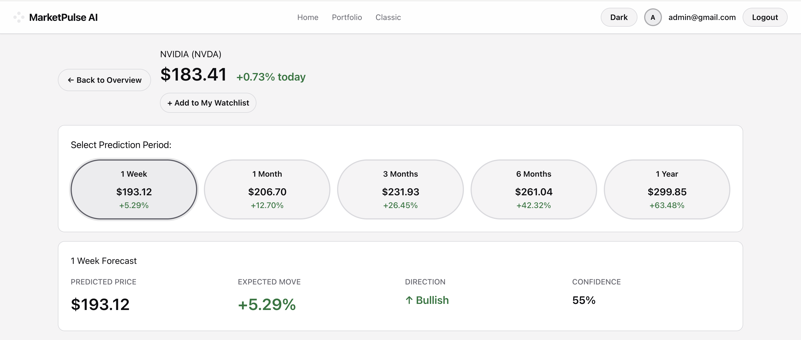

### 8) Classic — TradingView chart
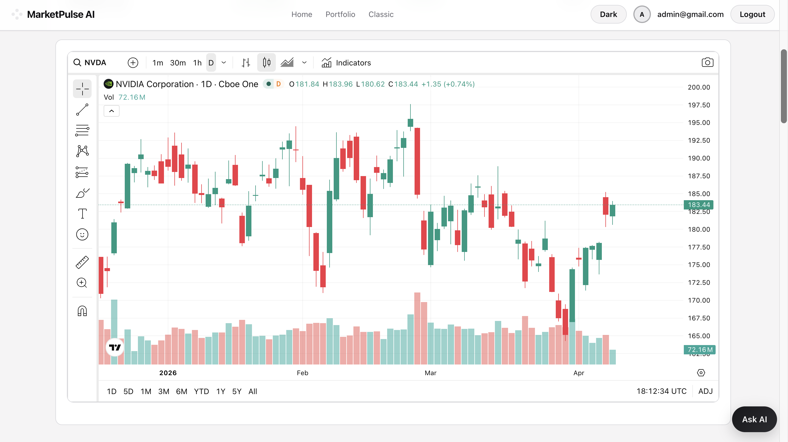

### 9) Reversal intelligence
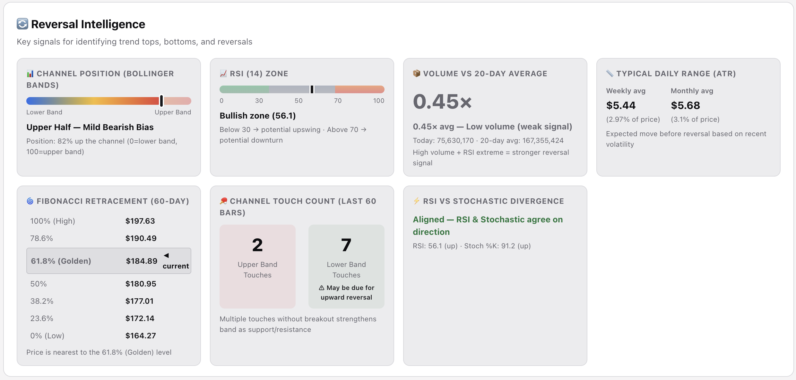

### 10) Prediction reasoning & patterns
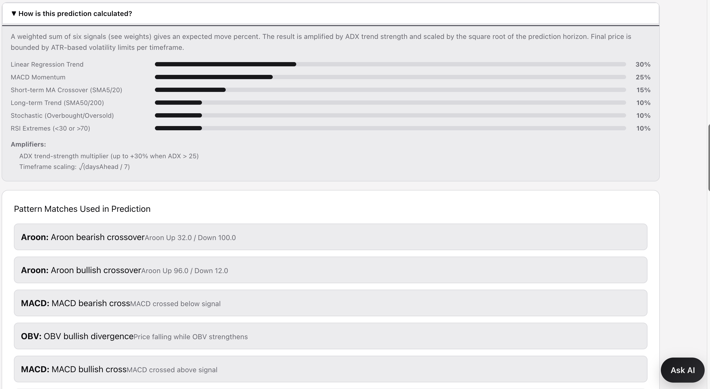

### 11) Technical indicators
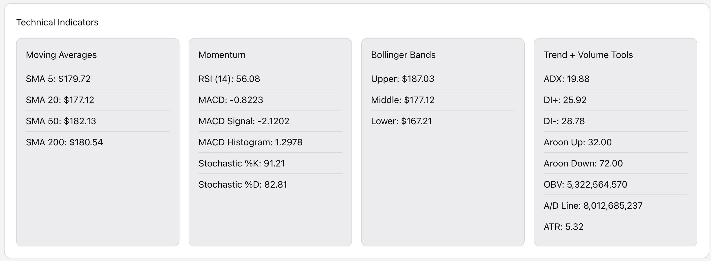

### 12) Comprehensive analysis
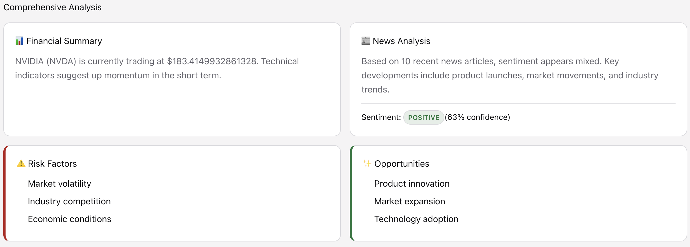

### 13) Latest news
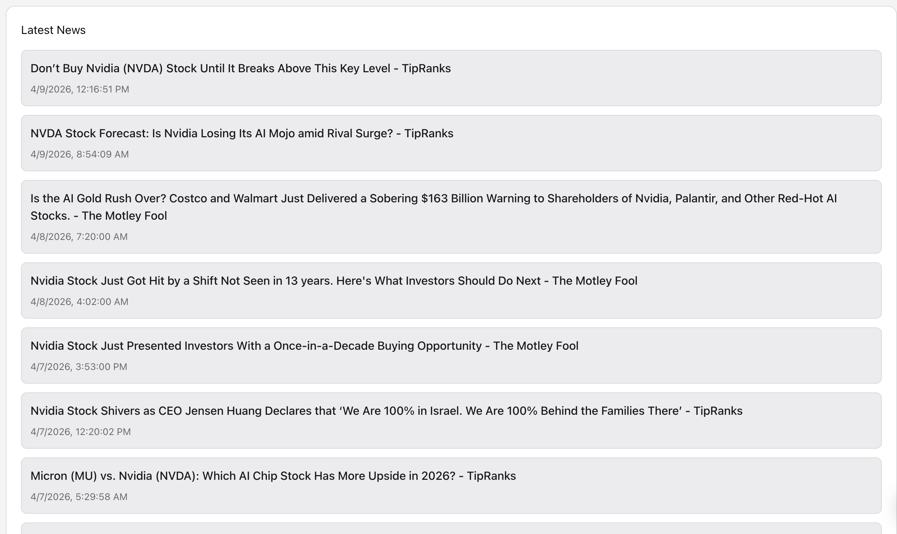

## Architecture

- `web/` — React + Vite frontend
- `server/` — Node.js + Express backend and analysis services
- `docs/images/` — documentation screenshots used in this README and USERGUIDE

## Tech Stack

- Frontend: React, Vite, React Router, Axios, lightweight-charts
- Backend: Node.js, Express, Axios, technicalindicators
- Data pipeline: market feeds, technical analysis, and analysis/signal orchestration
- Persistence: localStorage for user-side state (watchlist/portfolio context)

## Quick Start

### 1. Install dependencies

```bash
npm install
npm run install:all
```

### 2. Optional environment setup

```bash
cp .env.example server/.env
```

### 3. Run frontend and backend

```bash
npm run dev
```

### 4. Open locally

- Frontend: `http://localhost:5173`
- Backend health: `http://localhost:4000/api/health`

## Routes

- Dashboard: `http://localhost:5173/#/`
- Portfolio: `http://localhost:5173/#/portfolio`
- Stock detail example: `http://localhost:5173/#/stock/AAPL`

## API Endpoints

- `GET /api/health`
- `GET /api/companies`
- `GET /api/analyze`
- `GET /api/analyze/:symbol`

Example:

```bash
curl "http://localhost:4000/api/analyze/AAPL?markers=10&perIndicator=3"
```

## Documentation

- Full walkthrough: `USERGUIDE.md`
- Screenshot reference: `docs/images/README.md`

## Disclaimer

This project is for educational/demo usage only and is not financial advice.
