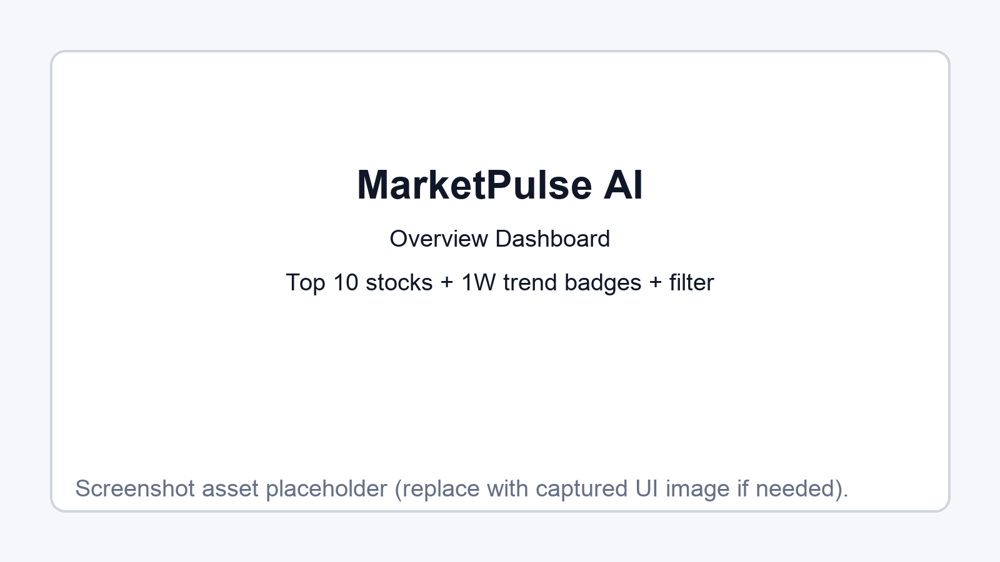
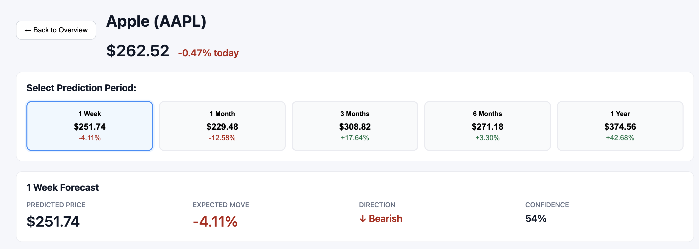
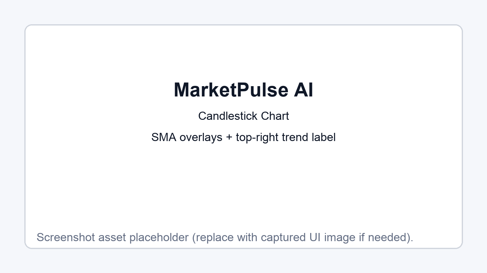
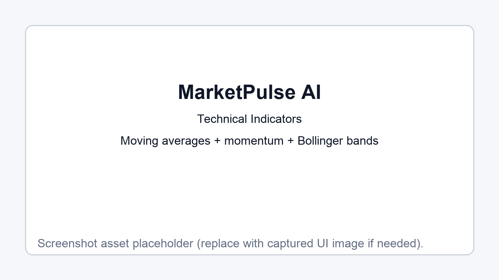
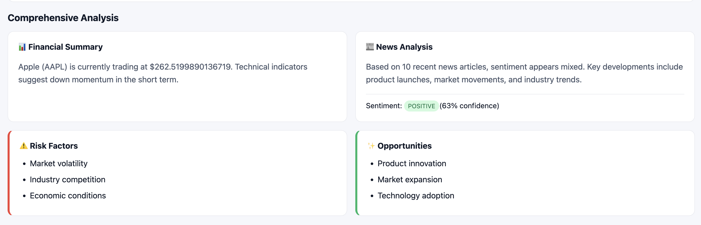
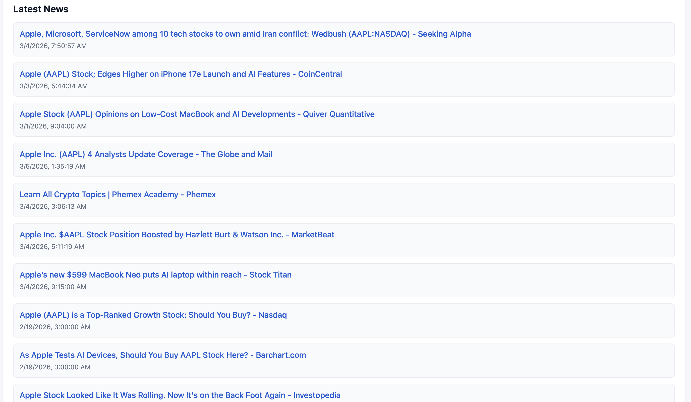

# MarketPulse AI User Guide

## Overview
MarketPulse AI provides live stock + news analysis for the top 10 US companies with multi-timeframe forecasts.

## Screenshots

### 1) Overview Dashboard


**What this shows**
- Top 10 stock cards with live price + daily movement
- Top-right `(1W trend)` badge derived from the 1-week prediction direction
- Quick filter bar for symbol/company search

---

### 2) Prediction Period Selector


**What this shows**
- Detail view for one stock
- Buttons for 1 Week / 1 Month / 3 Months / 6 Months / 1 Year forecasts
- Predicted price, expected move, direction, and confidence

---

### 3) Candlestick + Trend Overlay


**What this shows**
- OHLC candlestick chart
- SMA 5 / SMA 20 / SMA 50 overlays
- Top-right trend label that matches the selected prediction period

---

### 4) Technical Indicators Panel


**What this shows**
- Moving average metrics
- Momentum metrics (RSI / MACD)
- Bollinger Bands summary

---

### 5) Comprehensive Analysis + News


**What this shows**
- Financial summary and news analysis sections
- Risk factors and opportunities

---

### 6) Latest News Feed


**What this shows**
- Latest news feed for the selected symbol
- Clickable article links with source/timestamp context

## Run Locally

```bash
npm run install:all
npm run dev
```

- Frontend: http://localhost:5173
- Backend: http://localhost:4000

## API Marker Tuning

You can tune chart pattern-marker density from the API query string:

- `markers` = total number of pattern matches returned (range `3-30`, default `10`)
- `perIndicator` = max matches per indicator type (range `1-10`, default `3`)

Examples:

```bash
# Default behavior
curl "http://localhost:4000/api/analyze/AAPL"

# Cleaner chart (fewer markers)
curl "http://localhost:4000/api/analyze/AAPL?markers=8&perIndicator=2"

# More markers for deeper review
curl "http://localhost:4000/api/analyze/AAPL?markers=20&perIndicator=4"
```

You can also change these values directly in the stock detail screen under **Price Chart with Technical Indicators** using the `Markers` and `Per Indicator` dropdowns.
When you change them in the UI, the app updates the URL query (`?markers=...&perIndicator=...`), so refreshing the page keeps your selected settings.

The URL also stores your selected stock and prediction period (`symbol`, `period`, and `view=detail`), so shared/refresh links reopen the same stock detail context.
The overview stock filter is persisted too as `q`, so dashboard searches are retained after refresh and can be shared.
