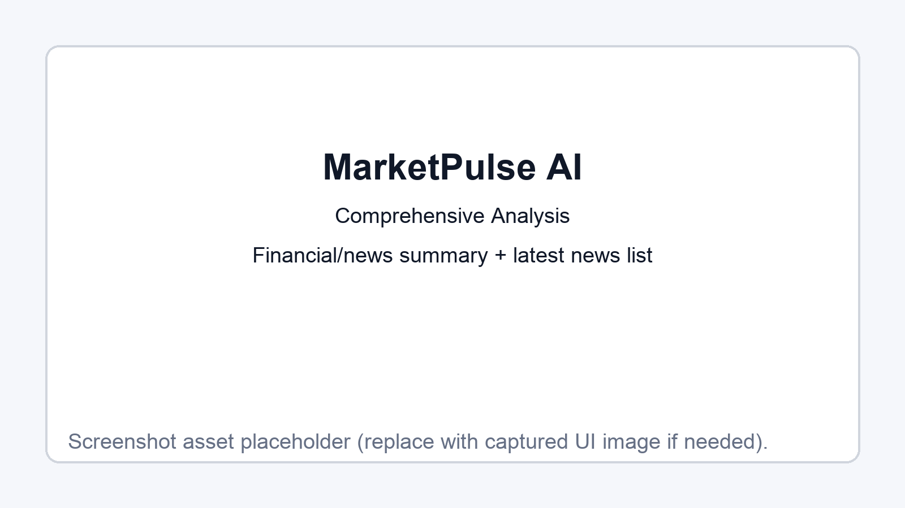

# MarketPulse AI User Guide

## Overview
MarketPulse AI provides live stock + news analysis for the top 10 US companies with multi-timeframe forecasts.

## Screenshots

### 1) Overview Dashboard


**What this shows**
- Top 10 stock cards with live price + daily movement
- Top-right `(1W trend)` badge derived from the 1-week prediction direction
- Quick filter bar for symbol/company search

---

### 2) Prediction Period Selector


**What this shows**
- Detail view for one stock
- Buttons for 1 Week / 1 Month / 3 Months / 6 Months / 1 Year forecasts
- Predicted price, expected move, direction, and confidence

---

### 3) Candlestick + Trend Overlay


**What this shows**
- OHLC candlestick chart
- SMA 5 / SMA 20 / SMA 50 overlays
- Top-right trend label that matches the selected prediction period

---

### 4) Technical Indicators Panel


**What this shows**
- Moving average metrics
- Momentum metrics (RSI / MACD)
- Bollinger Bands summary

---

### 5) Comprehensive Analysis + News


**What this shows**
- Financial summary and news analysis sections
- Risk factors and opportunities
- Latest news feed for the selected symbol

## Run Locally

```bash
npm run install:all
npm run dev
```

- Frontend: http://localhost:5173
- Backend: http://localhost:4000
