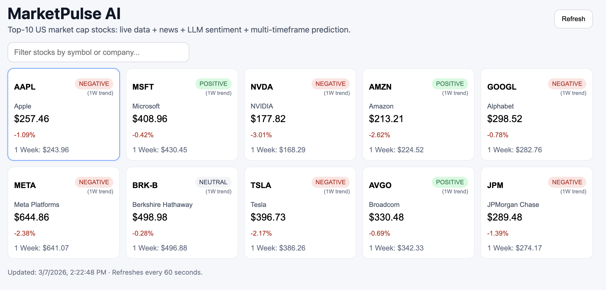
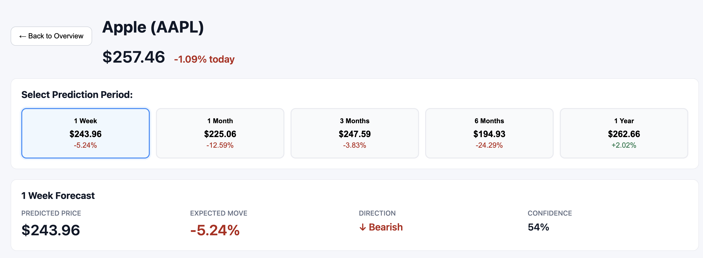
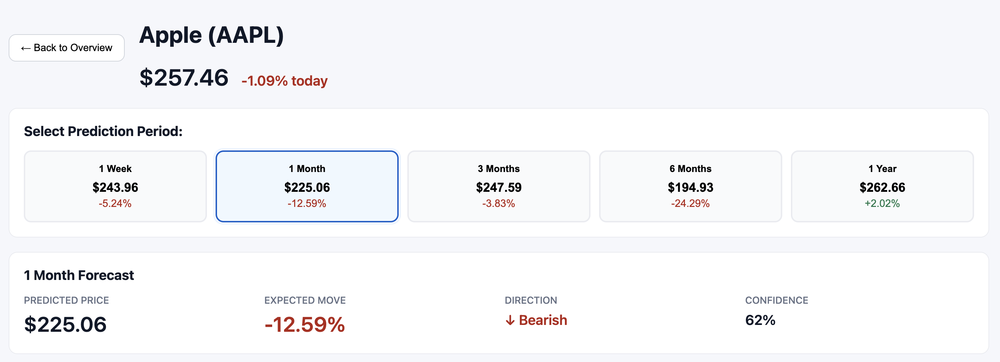
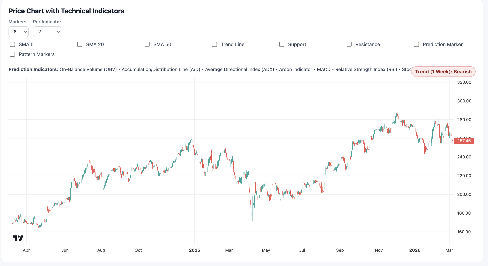
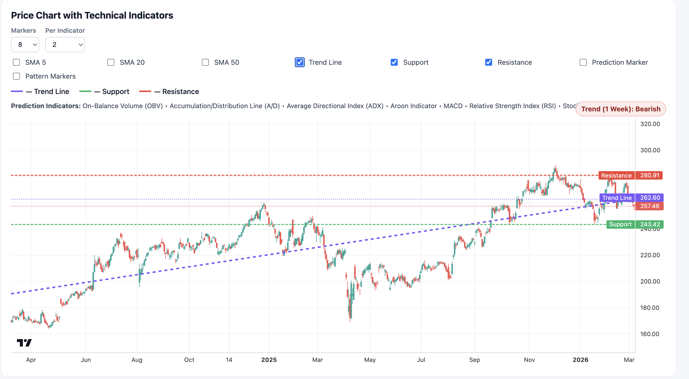
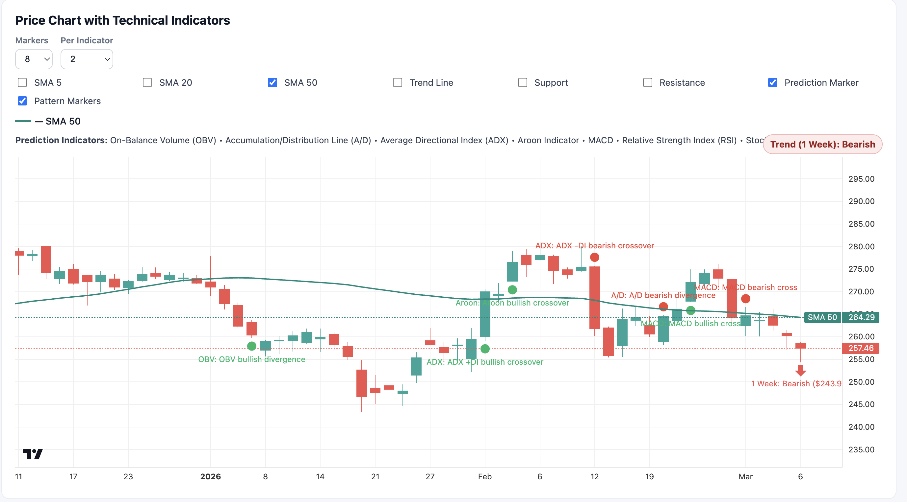
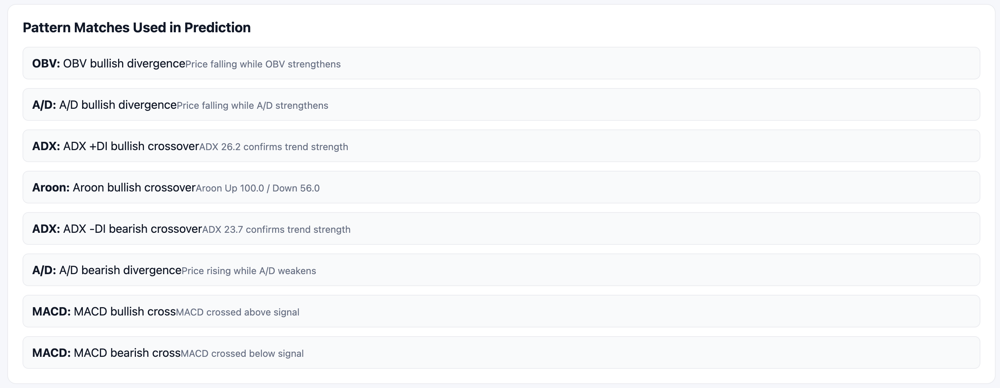
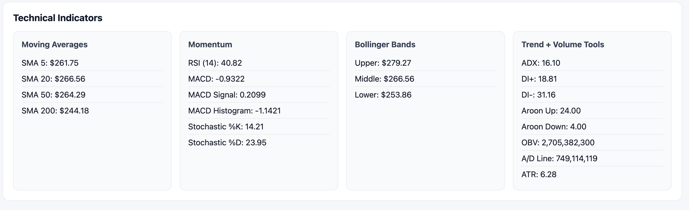
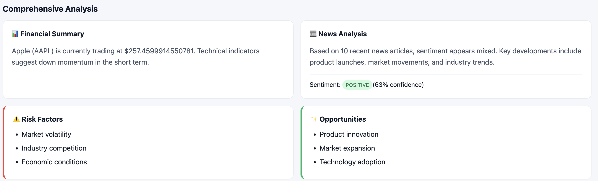
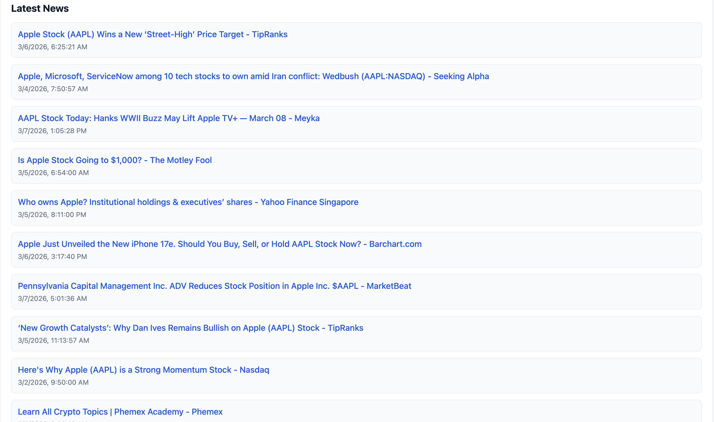

# MarketPulse AI User Guide

## Overview
MarketPulse AI provides real-time stock data, news analysis, and AI-powered predictions for the top 10 US companies by market cap. The platform combines technical analysis, pattern detection, and sentiment analysis to deliver multi-timeframe forecasts with adjustable chart indicators.

## Application Walkthrough

### 1. Dashboard Overview


**What you'll see:**
- **Top 10 Stock Cards**: Live prices with daily price changes and percentage movements
- **Trend Badges**: Quick 1-week trend indicators (↑ Bullish, ↓ Bearish, → Neutral)
- **Search Filter**: Type a symbol or company name to quickly find specific stocks
- **Current Prices**: Real-time stock data from Yahoo Finance

**How to use it:**
- Scroll through the dashboard to see all 10 stocks at a glance
- Use the search bar to filter stocks by symbol (e.g., "AAPL") or company name (e.g., "Apple")
- Click any stock card to view detailed analysis

---

### 2. Stock Detail Page


**What you'll see:**
- **Stock Header**: Company name, symbol, current price, and daily change
- **Prediction Summary**: AI-generated forecast for the selected timeframe
- **Period Selector**: Buttons to switch between different prediction periods
- **Back to Dashboard**: Navigation to return to the main view

**Key Features:**
- Detailed stock information in an organized layout
- Quick access to different prediction timeframes
- Comprehensive market data at a glance

---

### 3. Prediction Period Selector


**Available Prediction Timeframes:**
- **1 Week**: Short-term market movement predictions
- **1 Month**: Medium-term trend analysis
- **3 Months**: Quarterly forecast
- **6 Months**: Semi-annual outlook
- **1 Year**: Long-term investment perspective

**Prediction Details Include:**
- **Target Price**: Projected stock price at the end of the period
- **Expected Move**: Dollar amount and percentage change
- **Direction**: Bullish, Bearish, or Neutral trend
- **Confidence Level**: AI model's certainty in the prediction
- **Rationale**: Explanation of key factors driving the prediction

---

### 4. Candlestick Chart with Overlays


**Chart Features:**
- **Candlestick Patterns**: OHLC (Open, High, Low, Close) visualization
- **Moving Averages**: Multiple SMA and EMA overlays
  - SMA 5, 10, 20, 50, 100, 200
  - EMA 12, 26
- **Bollinger Bands**: Volatility indicators
- **Volume Data**: Trading volume bars below the main chart
- **Interactive Zoom**: Drag and scroll to explore different time ranges
- **Crosshair Tool**: Hover to see exact price and date information

**Technical Overlays:**
- Blue lines for short-term moving averages
- Purple/pink lines for long-term moving averages
- Shaded bands for Bollinger Band ranges

---

### 5. Indicator Toggle Controls


**Customizable Chart Indicators:**
You can show/hide individual technical indicators to reduce chart clutter and focus on specific signals:

**Available Toggles:**
- **Moving Averages**: SMA 5, 10, 20, 50, 100, 200
- **Exponential Moving Averages**: EMA 12, 26
- **Bollinger Bands**: Upper, middle, and lower bands
- **Trend Lines**: Support and resistance levels
- **Pattern Markers**: Visual indicators for detected patterns

**How to Use:**
- Click the toggle buttons to show/hide specific indicators
- Toggle off indicators you don't need to clean up the chart view
- Your preferences are saved in the URL for easy sharing
- Combine different indicators to build your preferred analysis setup

---

### 6. Chart with Pattern Detection


**Pattern Detection Features:**
The chart automatically identifies and highlights technical patterns:

- **Candlestick Patterns**: Doji, Hammer, Shooting Star, Engulfing, etc.
- **Trend Patterns**: Breakouts, reversals, consolidation zones
- **Momentum Indicators**: RSI oversold/overbought events
- **MACD Signals**: Bullish/bearish crossovers
- **Volume Anomalies**: Unusual trading volume spikes
- **Support/Resistance Breaks**: Key price level violations

**Pattern Markers:**
- Colored markers appear on the chart at relevant dates
- Hover over markers to see pattern details
- Different colors represent different indicator types
- Marker density can be adjusted (see next section)

---

### 7. Marker Control Settings


**Adjustable Marker Density:**
Fine-tune the number of pattern markers shown on the chart to match your analysis preference:

**Controls:**
- **Total Markers**: Set the maximum number of pattern markers (3-30)
  - Lower values (3-8): Clean chart with only the strongest signals
  - Medium values (9-15): Balanced view (default: 10)
  - Higher values (16-30): Comprehensive pattern detection
  
- **Per Indicator Limit**: Maximum markers per indicator type (1-10)
  - Lower values (1-2): Only the most significant events per indicator
  - Medium values (3-4): Balanced distribution (default: 3)
  - Higher values (5-10): Detailed pattern history per indicator

**Effect on Analysis:**
- **Fewer Markers**: Focus on high-confidence signals, cleaner chart
- **More Markers**: Comprehensive pattern coverage, detailed analysis
- Settings update the chart in real-time
- Values are saved to the URL for persistence

---

### 8. Technical Indicators Panel


**Comprehensive Indicator Dashboard:**

**Moving Averages:**
- SMA (5, 10, 20, 50, 100, 200 days)
- EMA (12, 26 days)
- Current price position relative to each average
- Trend signals from MA crossovers

**Momentum Indicators:**
- **RSI (Relative Strength Index)**: Overbought/oversold levels
  - Above 70: Overbought territory
  - Below 30: Oversold territory
- **MACD (Moving Average Convergence Divergence)**:
  - MACD line, Signal line, and Histogram
  - Bullish/Bearish crossover signals
- **Stochastic Oscillator**: %K and %D values with trend signals

**Volatility Metrics:**
- **Bollinger Bands**: Upper, middle, lower bands with current position
- **ATR (Average True Range)**: Market volatility measurement
- **Bandwidth**: Bollinger Band width indicator

**Volume Indicators:**
- **OBV (On-Balance Volume)**: Cumulative volume flow
- **A/D Line (Accumulation/Distribution)**: Buying/selling pressure
- **Volume Trend**: Recent volume compared to average

**Trend Strength:**
- **ADX (Average Directional Index)**: Trend strength measurement
  - Above 25: Strong trend
  - Below 20: Weak trend
- **Aroon Indicators**: Up/Down trend identification
- **Current Trend**: Overall directional bias

---

### 9. Comprehensive Analysis


**AI-Powered Analysis Sections:**

**Financial Summary:**
- Current market capitalization
- 52-week high/low range
- P/E ratio and other fundamental metrics
- Recent earnings performance
- Dividend information (if applicable)

**Sentiment Analysis:**
- AI-generated market sentiment from recent news
- Overall sentiment score (Bullish/Neutral/Bearish)
- Key factors influencing sentiment
- Social media and news trend analysis

**Risk Factors:**
- Market volatility assessment
- Company-specific risks
- Sector and industry challenges
- Regulatory or competitive concerns
- Technical risk indicators

**Opportunities:**
- Growth catalysts identified by AI
- Positive news and developments
- Technical breakout potential
- Sector tailwinds
- Strategic advantages

**News Impact:**
- How recent news affects stock outlook
- Correlation between news sentiment and price movement
- Major announcements and their implications

---

### 10. Latest News Feed


**Real-Time News Integration:**

**Features:**
- **Latest Articles**: Recent news from Google News RSS feeds
- **Source Attribution**: Publisher name and publication time
- **Relevance Filtering**: Only news related to the selected stock
- **Clickable Links**: Direct access to full articles
- **Sentiment Indicators**: AI-assessed impact (Positive/Neutral/Negative)
- **Time Stamps**: How recent each article is

**How News Integrates with Analysis:**
- News sentiment feeds into AI prediction models
- Major news events trigger pattern detection updates
- Sentiment changes are reflected in comprehensive analysis
- Historical correlation between news and price movements

**News Sources:**
- Financial news outlets (WSJ, Bloomberg, Reuters)
- Tech and business publications
- Company press releases
- Industry-specific media

---

## Getting Started

### Installation

1. **Clone the repository**
   ```bash
   git clone https://github.com/EltonChang1/MarketPulse-AI.git
   cd MarketPulse-AI
   ```

2. **Install dependencies**
   ```bash
   npm install
   npm run install:all
   ```

3. **Set up environment (optional)**
   ```bash
   cp .env.example server/.env
  # Optional in server/.env:
  # Default_Gemini_API_Key=your_key_here
  # GEMINI_MODELS=gemini-1.5-flash,gemini-1.5-pro
   ```

4. **Run the application**
   ```bash
   npm run dev
   ```

5. **Access the app**
   - Frontend: http://localhost:5173
   - Backend API: http://localhost:4000

---

## Advanced Features

### API Marker Tuning

You can fine-tune chart pattern-marker density using API query parameters or UI controls:

**API Query Parameters:**
- `markers`: Total number of pattern matches (range: 3-30, default: 10)
- `perIndicator`: Max matches per indicator type (range: 1-10, default: 3)

**API Examples:**

```bash
# Default behavior
curl "http://localhost:4000/api/analyze/AAPL"

# Cleaner chart (fewer markers)
curl "http://localhost:4000/api/analyze/AAPL?markers=8&perIndicator=2"

# More markers for deeper review
curl "http://localhost:4000/api/analyze/AAPL?markers=20&perIndicator=4"
```

**UI Controls:**
- Adjust marker settings in the stock detail view using dropdown controls
- Changes update the URL automatically
- Settings persist across page refreshes
- Share customized views via URL

---

### URL Parameter Reference

The application uses URL parameters for state persistence and deep linking:

- `view=detail`: Show stock detail page instead of dashboard
- `symbol=AAPL`: Select specific stock symbol
- `period=1m`: Set prediction timeframe (1w, 1m, 3m, 6m, 1y)
- `markers=10`: Number of pattern markers to display
- `perIndicator=3`: Maximum markers per indicator type
- `q=apple`: Dashboard search filter

**Example URLs:**

```
# Apple stock with 1-month prediction and custom markers
http://localhost:5173/?view=detail&symbol=AAPL&period=1m&markers=15&perIndicator=4

# Dashboard filtered for "tech" stocks
http://localhost:5173/?q=tech

# Tesla with 6-month outlook and minimal markers
http://localhost:5173/?view=detail&symbol=TSLA&period=6m&markers=5&perIndicator=2
```

---

## Tips for Best Experience

1. **Start with the Dashboard**: Get an overview of all 10 stocks before diving into details
2. **Use Search Effectively**: Filter by symbol or company name to quickly find stocks
3. **Try Different Timeframes**: Compare short-term vs long-term predictions for better insights
4. **Adjust Marker Density**: Start with default (10 markers), then fine-tune based on your needs
5. **Toggle Indicators**: Hide indicators you're not using to reduce chart clutter
6. **Check News Regularly**: Fresh news directly impacts analysis and predictions
7. **Combine Multiple Views**: Use technical indicators + news + AI analysis together
8. **Bookmark Custom Views**: Use URL parameters to save your preferred settings
9. **Compare Stocks**: Open multiple tabs with different symbols for side-by-side analysis
10. **Watch for Pattern Markers**: Pay attention to clustered markers as they indicate significant events

---

## Troubleshooting

### App won't start
- Ensure all dependencies are installed: `npm run install:all`
- Check that ports 4000 and 5173 aren't already in use
- Try cleaning node modules: `rm -rf node_modules server/node_modules web/node_modules && npm run install:all`

### No data showing
- Verify backend is running: `curl http://localhost:4000/api/health`
- Check network connection (app fetches live data from Yahoo Finance)
- Wait a moment for initial data load (can take 5-10 seconds)

### Charts not displaying
- Clear browser cache and refresh
- Check browser console for errors
- Ensure JavaScript is enabled

### Predictions seem outdated
- Predictions are generated on-demand and cached briefly
- Refresh the page to get latest analysis
- News and sentiment data updates every few minutes

---

## API Endpoints Reference

### Health Check
```
GET /api/health
Returns: { "status": "ok", "timestamp": "..." }
```

### All Companies
```
GET /api/companies
Returns: Array of top 10 company objects with basic info
```

### Bulk Analysis
```
GET /api/analyze?markers=10&perIndicator=3
Returns: Array with analysis for all 10 stocks
```

### Single Stock Analysis
```
GET /api/analyze/:symbol?markers=10&perIndicator=3
Example: /api/analyze/AAPL?markers=15&perIndicator=4
Returns: Detailed analysis object for specified stock
```

---

## Educational Note

MarketPulse AI is designed for **educational and demonstration purposes only**. This is not financial advice, and you should not make investment decisions based solely on this tool. Always consult with a qualified financial advisor before making investment decisions.

The predictions generated by this application are based on technical analysis and historical patterns. Past performance does not guarantee future results, and all investments carry risk.

---

## Support

For issues, questions, or contributions:
- GitHub Issues: https://github.com/EltonChang1/MarketPulse-AI/issues
- See README.md for additional setup information
- Check the codebase documentation for developer details
