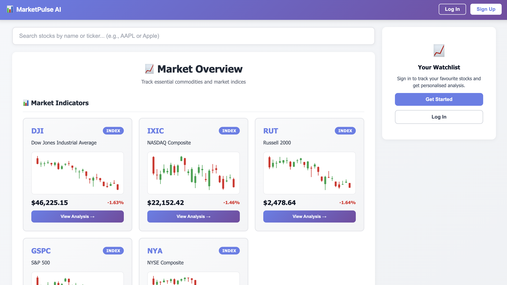
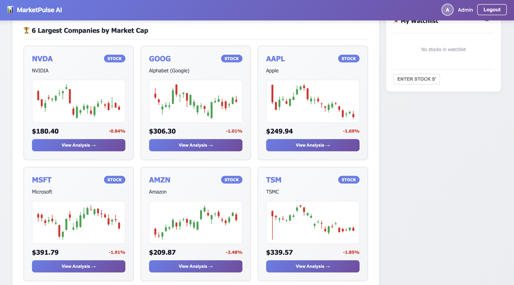
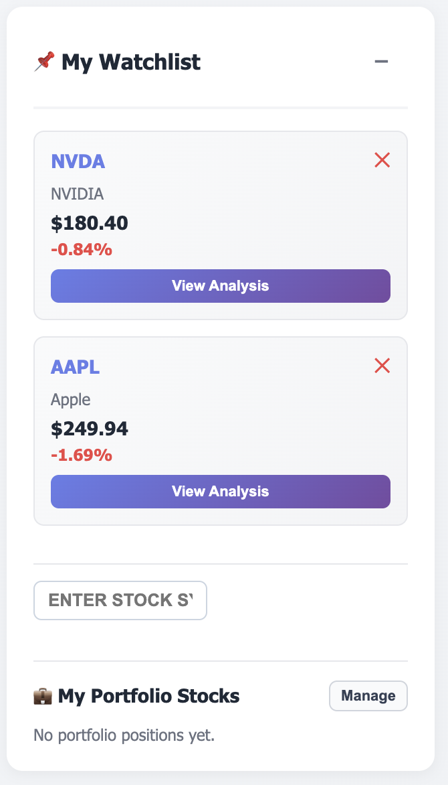

# MarketPulse AI User Guide

This guide covers the current portfolio-centered experience of MarketPulse AI and walks through each screen in a strict image order.

## Table of Contents

1. [Purpose](#purpose)
2. [Before You Start](#before-you-start)
3. [Core Workflow (Ordered Screens)](#core-workflow-ordered-screens)
4. [Running the App](#running-the-app)
5. [Routes](#routes)
6. [API Reference](#api-reference)
7. [Data Model Notes](#data-model-notes)
8. [Troubleshooting](#troubleshooting)
9. [Disclaimer](#disclaimer)

## Purpose

MarketPulse AI helps you track portfolio performance using a transaction ledger instead of manual holdings edits.

You can:
- Add `BUY` and `SELL` trades with trade dates
- Reconstruct holdings from historical transactions
- View current allocation by symbol
- Compare portfolio return to major US benchmarks
- Access portfolio symbols from the dashboard sidebar

## Before You Start

- Node.js installed
- Dependencies installed for root, server, and web packages
- Optional: server environment values configured in `server/.env`

## Core Workflow (Ordered Screens)

### Step 1 — Portfolio Overview (`11`)


What to look for:
- Summary cards for portfolio-level metrics
- Main layout sections (entry form, allocation, benchmark chart, history)
- Quick status of your current portfolio state

---

### Step 2 — Add Transaction Form (`12`)


How to use:
- Choose side: `Buy` or `Sell`
- Enter symbol (example: `AAPL`)
- Enter quantity
- Enter trade date
- Optionally enter trade price (otherwise live price is used as fallback)

Validation behavior:
- Quantity must be positive
- Symbol is normalized to uppercase
- Sell quantity cannot exceed current held quantity for the symbol

---

### Step 3 — Allocation Donut (`13`)


How it is calculated:
- Uses derived current holdings (not manual percentages)
- Computes each symbol weight as a percent of total portfolio market value
- Updates automatically after transaction changes

---

### Step 4 — Portfolio vs Market Comparison (`14`)


Benchmarks included:
- DJIA
- NASDAQ
- S&P 500
- Russell 2000

Computation model:
- Portfolio positions are replayed chronologically from transaction dates
- Historical prices are aligned by date
- Return series is normalized from baseline and plotted against indexes

---

### Step 5 — Dashboard Portfolio Sidebar (`15`)


What this gives you:
- Portfolio symbols and quantities directly under watchlist context
- Fast navigation from dashboard to symbol detail
- Quick link to full portfolio management page

---

### Step 6 — Transaction History (`16`)


Each row records:
- Side (`BUY` / `SELL`)
- Date
- Symbol
- Quantity
- Price
- Total value

Why it matters:
- This is the source-of-truth ledger
- It enables auditability and accurate replay of portfolio performance

---

### Step 7 — Derived Holdings (`17`)


Derived holdings show:
- Current quantity per symbol
- Cost basis / average acquisition context
- Current market value and unrealized results

Important:
- Holdings are derived from transactions, not independently edited

## Running the App

### Install

```bash
npm install
npm run install:all
```

### Optional env setup

```bash
cp .env.example server/.env
```

### Start

```bash
npm run dev
```

### Local URLs

- Frontend: `http://localhost:5173`
- Backend: `http://localhost:4000`
- Health check: `http://localhost:4000/api/health`

## Routes

- `/#/` — dashboard
- `/#/portfolio` — portfolio page
- `/#/stock/:symbol` — stock detail page

Hash routing is used to make browser refresh safe on deep links.

## API Reference

- `GET /api/health`
- `GET /api/companies`
- `GET /api/analyze`
- `GET /api/analyze/:symbol`

Example:

```bash
curl "http://localhost:4000/api/analyze/AAPL?markers=10&perIndicator=3"
```

## Data Model Notes

Portfolio persistence is user-scoped in localStorage and modeled as a transaction ledger.

- Source of truth: transaction list
- Derived outputs: holdings, allocation, and portfolio performance
- Backward compatibility: legacy holdings shape is auto-migrated to transactions

## Troubleshooting

### App does not start
- Run `npm run install:all` again
- Ensure ports `4000` and `5173` are free

### Backend works but data is empty
- Confirm health endpoint: `curl http://localhost:4000/api/health`
- Verify outbound network access to upstream market/news services

### Portfolio numbers seem off
- Audit transaction rows first (date, side, quantity, price)
- Remove incorrect rows and re-enter valid transactions

## Disclaimer

MarketPulse AI is for educational and demonstration use only and does not provide financial advice.
